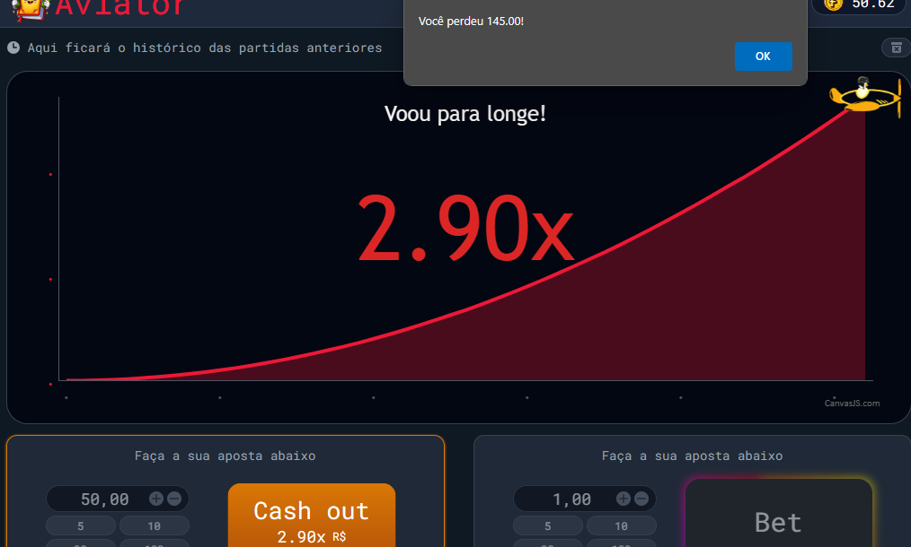

# Aviator Game (Jogo do aviãozinho)

Este é um projeto baseado no famoso jogo de aposta Aviator.

## Visão Geral

O Aviator Game é uma recriação do popular jogo de aposta Aviator. Nele, os jogadores têm a oportunidade de apostar em um avião em movimento e tentar "prever" até onde ele ficará voando em tela, pois se não ele voará demais e o jogador perderá a aposta.

O objetivo é fazer apostas precisas e retirar o dinheiro antes do avião voar para longe!

## Como Jogar

1. Acesse o jogo através deste [link](https://brendon3578.github.io/aviator-game-test/src/index.html).
2. Faça sua aposta e clique no botão "bet" para apostar.
3. Retire a sua aposta antes do avião voar para longe.
4. Ganhe a aposta com base na precisão da sua remoção de aposta e no nível de dificuldade do voo.

---

<h3 align="center">
    Feito com ☕ por <a href="https://github.com/Brendon3578"> Brendon Gomes</a>
</h3>
